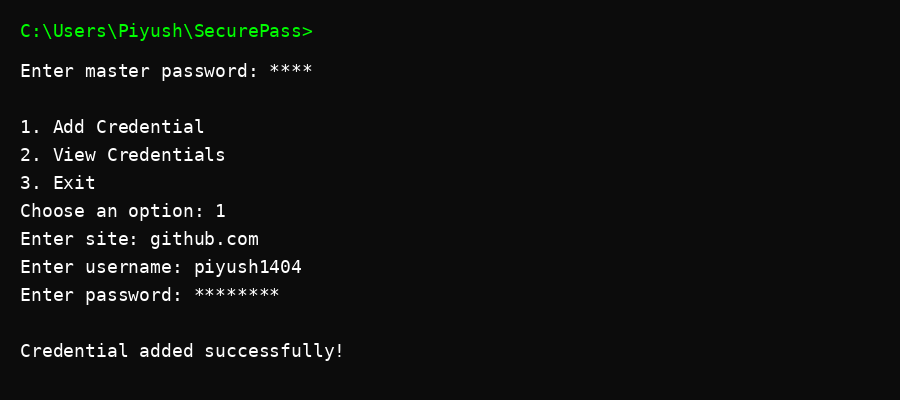

# SecurePass – CLI Password Manager

A simple command-line password manager built in C++.

## Features
- Master password authentication
- Add and view credentials
- Simple Caesar cipher encryption
- Object-Oriented Design

## Build Instructions

```
g++ main.cpp password_manager.cpp -o securepass
```

## Run
```
./securepass
```

